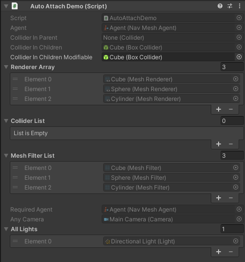

# Unity auto attach
Auto attach components to serialized fields.

Attaches components in editor when any MonoBehaviour selected, removed or added. 
Attaches only once, so there is almost no performance impact.

Component, components array and component list are supported. For other types you can implement abstract AutoSetter class.

Examples:

```c#
    public class AutoAttachDemo : MonoBehaviour
    {
        [Attach] //Get component on current gameObject
        public NavMeshAgent agent;
        
        [Attach(Attach.Parent)] //Get component in parent gameObjects
        public Collider colliderInParent;
        
        [Attach(Attach.Children)] //Get component in children gameObjects
        [SerializeField]
        private Collider colliderInChildren;
        
        [Attach(Attach.Children, false)] //Get component in children gameObjects, can be changed in inspector
        [SerializeField]
        private Collider colliderInChildrenModifiable;

        [Attach(Attach.Children)] //Get components in children gameObjects
        [SerializeField]
        private Renderer[] rendererArray;

        [Attach(Attach.Parent)] //Get components in parent gameObjects
        [SerializeField]
        private List<Collider> colliderList;
        
        [Attach(Attach.Children)] //Get components in children gameObjects
        [SerializeField]
        private List<MeshFilter> meshFilterList;

        [AttachOrAdd] //Get component on current gameObject or add if not exist (similar to RequireComponent)
        public NavMeshAgent requiredAgent;

        [Attach(Attach.Scene)] //Get component in scene
        [SerializeField] private Camera anyCamera;

        [Attach(Attach.Scene)] //Get components in scene
        [SerializeField] private Light[] allLights;
    }
```


